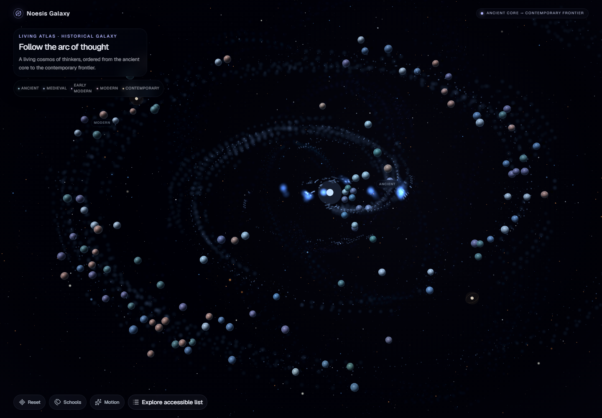
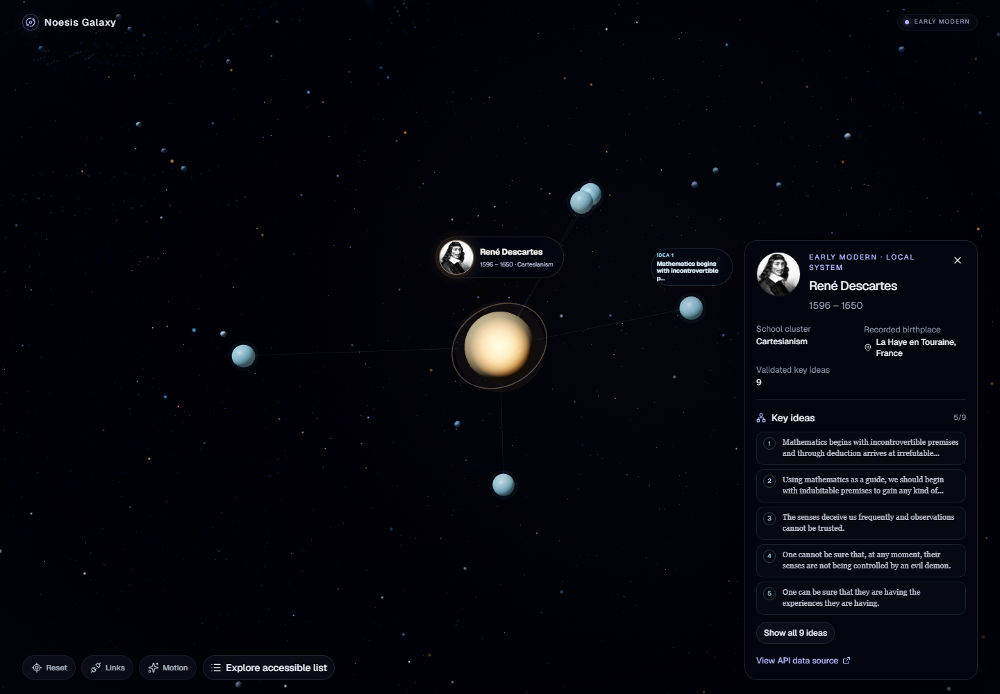
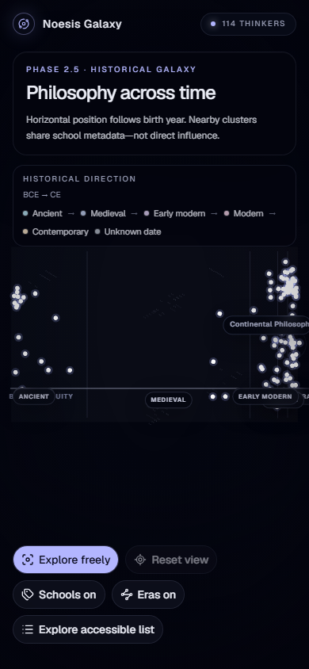

# Noesis Galaxy

Noesis Galaxy is a completed GitHub portfolio demonstration: an interactive
Three.js atlas that places philosophers and their ideas in a deterministic
historical galaxy.

The runtime uses the public Philosophers API. Tests replace that network with
deterministic fixtures, so browser behavior can be verified without pretending
that fixture data is the live service. This repository does not include a
backend, persistence layer, authentication, or deployment configuration.

## Final presentation



| Philosopher focus | Mobile focus |
| --- | --- |
|  |  |

The approved implementation and its limitations are recorded in the
[Phase 2.75 visual finalization](docs/phase-2-75-visual-finalization.md).

## What the demonstration includes

- An era-weighted deterministic spiral from the ancient core to the
  contemporary frontier, with three soft dust arms and real z-depth.
- Every validated API philosopher rendered as an equal-importance, shared
  instanced celestial sphere with directional shading, rim light, and subtle
  procedural surface variation.
- Three round-star background layers with cool, neutral, and warm temperature
  variation.
- A selected philosopher presented as a restrained solar system with bounded
  idea satellites and progressive disclosure.
- Agreement and disagreement shown only when the selected idea's API record
  explicitly supplies those relationships. School, category, date, distance,
  and prose never create inferred edges.
- URL-restorable philosopher and idea selection.
- Responsive desktop and mobile camera modes with stable wheel and pinch zoom.

## Controls

- Drag to orbit; use the wheel or pinch gesture to dolly while preserving the
  current semantic target.
- **Reset** returns to the complete galaxy.
- **Schools** reveals the limited school labels in overview.
- **Links** toggles direct idea links while focused.
- **Motion** pauses background and idea-orbit movement.
- **Explore accessible list** opens the keyboard-accessible HTML alternative
  for browsing and selecting every philosopher.
- **Back to philosopher** and **Back to galaxy** unwind idea and philosopher
  focus states.

`CameraControls` runs with `dollyToCursor` disabled, explicit distance bounds,
and reduced damping. Zoom changes distance without retargeting toward the
pointer or scrolling the document.

## Visual encoding and data boundaries

Birth year determines chronological progress along the spiral. School metadata
adds only a small deterministic local offset; proximity does not imply
influence or agreement. Philosopher bodies have equal base importance. Their
restrained color and accent variation is presentational and never a rank.

The overview requests no portraits. Hover can request a small thumbnail, while
selection requests one face or illustration used by both the scene medallion
and detail panel through the browser cache. Initials remain the fallback.

The production application queries `https://philosophersapi.com`. Unit and
Playwright tests intercept those requests with versioned fixtures. `pnpm
api:smoke` is the separate live-service contract check.

## Accessibility and responsive behavior

The accessible explorer is focus-managed and keyboard operable. Philosopher,
era, lifespan, school, idea, and relationship meaning remains available as HTML
text. The explorer also remains available when WebGL is unsupported or the
scene boundary fails.

Reduced-motion preference makes camera transitions immediate and freezes
ambient, orbit, and landmark movement without hiding content. At 390×844 the
selected detail becomes a scrollable bottom sheet capped at 42svh, leaving the
celestial system visible above it.

## Measured performance

Measurements below come from the final production build and Chromium runtime
on 2026-08-05. Draw calls may vary slightly by browser and GPU.

| Metric | Final measurement |
| --- | ---: |
| Initial JavaScript | 499.87 kB / 155.10 kB gzip |
| Lazy galaxy JavaScript | 988.98 kB / 263.14 kB gzip |
| Lazy philosopher summary | 8.15 kB / 2.72 kB gzip |
| CSS | 55.34 kB / 10.75 kB gzip |
| Overview draw calls | 22 |
| Desktop philosopher-focus draw calls | 38 |
| Mobile philosopher-focus draw calls | 34 |
| Desktop background stars | 4,148 |
| Mobile background stars | 1,418 |

The on-demand Three.js galaxy chunk remains above Vite's 500 kB advisory. It is
lazy-loaded and no additional bundle-optimization phase was added.

## Technology

- React 19, strict TypeScript 6, and Vite 8
- Three.js, React Three Fiber, and Drei CameraControls
- TanStack Router, TanStack Query, Zod, and Zustand
- Tailwind CSS 4, Base UI, Motion, and Lucide React
- Vitest, React Testing Library, Playwright Chromium, ESLint, and pnpm

## Requirements and commands

- Node.js 22.12 or newer; CI uses Node.js 24
- pnpm 10.30.0

```powershell
git clone https://github.com/alicanyayl/noesis-galaxy.git
cd noesis-galaxy
pnpm install
pnpm dev
```

| Command | Purpose |
| --- | --- |
| `pnpm dev` | Start the Vite development server |
| `pnpm preview` | Serve the production build locally |
| `pnpm lint` | Run ESLint with zero warnings |
| `pnpm typecheck` | Type-check application, scripts, and tests |
| `pnpm test:run` | Run deterministic Vitest tests |
| `pnpm test:e2e` | Run deterministic Chromium interaction tests |
| `pnpm api:smoke` | Validate the live Philosophers API contract |
| `pnpm build` | Type-check and create the production build |
| `pnpm check` | Run lint, typecheck, Vitest, and build |

## Project status and limitations

The portfolio demonstration is complete through the approved Phase 2.75 visual
system. Phase 3 storytelling could be explored in the future, but it is neither
implemented nor required for this project to be complete.

Known limitations:

- Visual QA and E2E coverage target Chromium, not Firefox or WebKit.
- Live content depends on the external Philosophers API being available and
  preserving its validated contract.
- HTML scene labels can approach viewport edges after aggressive free orbit;
  the detail panel and accessible explorer preserve the same information.
- The lazy Three.js chunk retains the documented Vite size advisory.

## License

MIT. See [LICENSE](LICENSE).
