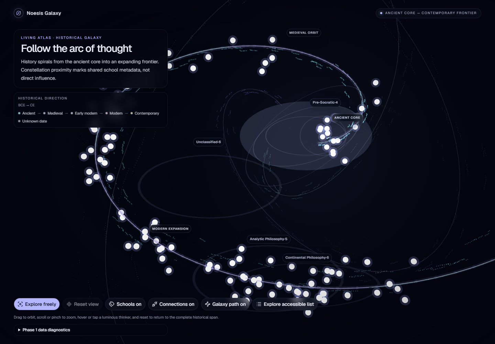
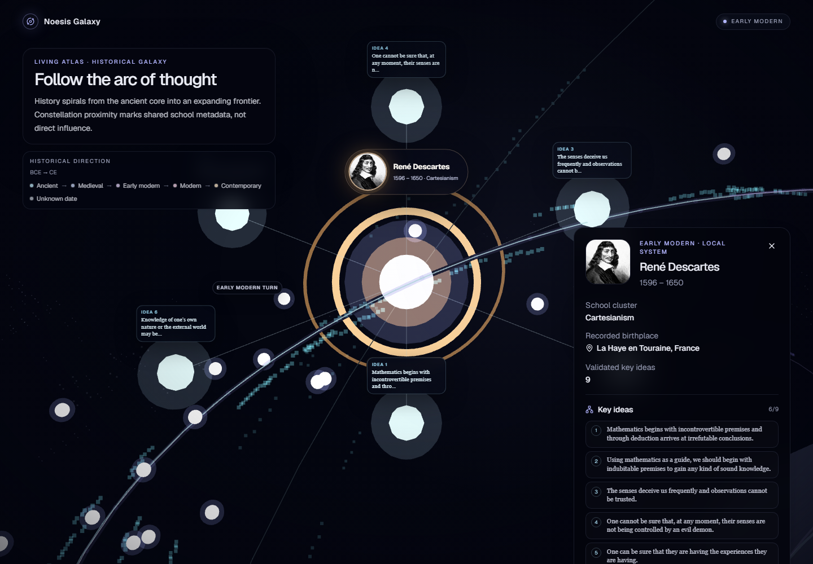
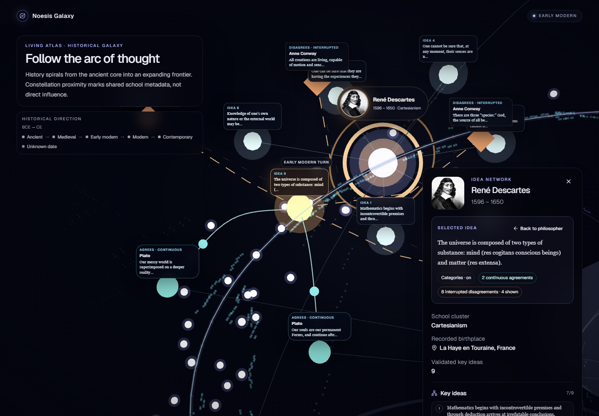
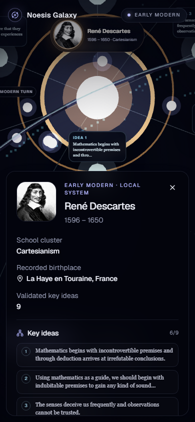

# Noesis Galaxy

An interactive Three.js atlas of philosophers, ideas, history, agreement, and
contradiction.

## Status

The Phase 2 galaxy redesign is implemented. The official Philosophers API
drives a deterministic, curved historical universe containing every validated
philosopher. Selecting a thinker reveals their key-idea system; selecting an
idea reveals only the API's explicit agreement and disagreement relationships.



| Philosopher system | Explicit idea network | Mobile focus |
| --- | --- | --- |
|  |  |  |

All four images are real Playwright Chromium/WebGL captures using the live API.
The visual reasoning, relationship sample, performance measurements, and known
limits are documented in the [Phase 2 galaxy redesign notes](docs/phase-2-galaxy-redesign.md).

## Explore

- Read history from the ancient core through the medieval orbit and expanding
  modern and contemporary arms.
- Hover a philosopher to reveal a lazy thumbnail, name, lifespan, and school.
- Select a philosopher node—or use the accessible explorer—to enter their local
  key-idea system.
- Select an idea to reveal its text, categories, owning thinker, and explicit
  agreeing or disagreeing ideas.
- Follow smooth, flowing cyan connections for agreement and broken angular
  amber connections for disagreement. Shape, labels, and motion distinguish the
  relationships without relying on color.
- Select a related idea to travel to its owning philosopher and preserve the
  relationship in the URL.
- Use **Back to philosopher**, **Back to galaxy**, or **Reset view** to leave a
  focus state.
- Toggle connections, school regions, and the historical galaxy path; drag to
  orbit and scroll or pinch to zoom.

Selection is shareable as
`/?philosopher=<philosopher-id>&idea=<key-idea-id>`. TanStack Router owns browser
history; camera coordinates are not persisted.

## Visual and data model

Birth year becomes an era-weighted progress scalar on a deterministic spiral.
The scalar remains chronological while giving Ancient, Medieval, Early modern,
Modern, and Contemporary records enough authored arc length to remain legible.
Unknown years occupy a separate uncertainty location.

School metadata adds a small deterministic offset normal to the historical
curve. Soft regions and local proximity therefore mean shared metadata only:
they do not imply influence, lineage, agreement, or causation.

Philosophers use equal base importance. The scene does not guess fame or
importance. Every thinker shares the same instanced core/halo system, with only
hover and selection changing emphasis.

The philosopher detail and key-idea collection load on selection. Only the
selected key idea requests its detail record, which supplies explicit
`agreeingKeyIdeas` and `disagreeingKeyIdeas`. No relation is inferred from
category, school, date, or proximity.

## Portrait strategy

The overview makes no image requests. Hover prefers an API thumbnail. A selected
scene medallion and HTML detail panel prefer a modest face/illustration asset,
share the browser cache, keep the original aspect ratio with `object-fit`, and
fall back to initials. Full-body and full-resolution portrait sets are never
loaded eagerly.

## Accessibility and motion

The focus-managed accessible explorer remains usable when WebGL is unsupported
or the scene boundary fails. Era, school, lifespan, idea, and relationship
meaning are also present as HTML text. Buttons expose pressed state and have
keyboard focus styles.

Reduced-motion preference changes camera transitions to immediate movement,
stops the flowing agreement marker, and preserves every label and relationship.
On mobile, selection becomes a scrollable bottom sheet while the local system
remains visible above it.

## Performance

- Philosopher cores and halos: two instanced meshes for 114 live records
- Overview: 31 measured draw calls and zero image requests
- Philosopher focus: 6 visible idea nodes and 44 measured draw calls
- Idea focus: 13 semantic idea/relation nodes and 67 measured draw calls
- Initial JavaScript: 499.80 kB (154.98 kB gzip)
- Lazy galaxy JavaScript: 974.21 kB (258.80 kB gzip)
- Lazy philosopher summary: 7.88 kB (2.66 kB gzip)
- CSS: 53.79 kB (10.53 kB gzip)

Vite's >500 kB advisory remains for the on-demand Three.js galaxy chunk. The
initial application script remains below that threshold.

## Technology

- React 19, strict TypeScript 6, and Vite 8
- Three.js, React Three Fiber, and Drei CameraControls
- TanStack Router and TanStack Query
- Zod, Zustand, Motion, Tailwind CSS 4, Base UI, and Lucide React
- Vitest, React Testing Library, Playwright Chromium, ESLint 10, and pnpm 10

## Requirements and commands

- Node.js 22.12 or newer; Node.js 24 is used in CI
- pnpm 10.30.0

```powershell
git clone https://github.com/alicanyayl/noesis-galaxy.git
cd noesis-galaxy
pnpm install
pnpm dev
```

| Command | Purpose |
| --- | --- |
| `pnpm dev` | Start the Vite development server |
| `pnpm build` | Type-check application code and create a production build |
| `pnpm preview` | Preview the production build locally |
| `pnpm lint` | Run ESLint with zero warnings allowed |
| `pnpm typecheck` | Type-check application, scripts, and tests |
| `pnpm test:run` | Run the deterministic Vitest suite |
| `pnpm test:e2e` | Run deterministic Chromium interaction tests |
| `pnpm api:smoke` | Fetch and validate the live philosopher collection |
| `pnpm check` | Run lint, typechecking, tests, and production build |

## Roadmap

- [x] Phase 0: Foundation
- [x] Phase 1: Philosophers API data foundation
- [x] Phase 2: Historical galaxy
- [x] Phase 2.5: Visual readability remediation
- [x] Phase 2 redesign: Curved galaxy and explicit idea relationships
- [ ] Phase 3: Scroll-driven historical narrative
- [ ] Later: Branching journeys, encounters, and the full Idea Clash mode

The current phase intentionally excludes scroll storytelling, branching
questions, quizzes, audio, maps, imported 3D models, authentication, database,
persistence, backend work, and deployment.

## License

MIT. See [LICENSE](LICENSE).
