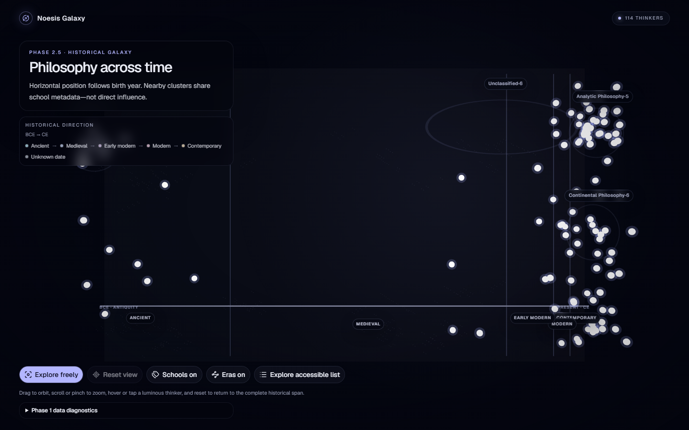

# Noesis Galaxy

An interactive Three.js journey through philosophers, ideas, history, and
contradictions.

## Status

**Phase 2.5 — Visual Readability and Historical Galaxy Art Direction** is
implemented. The official Philosophers API drives a deterministic, visually
verified Three.js scene containing every validated philosopher record.

Birth year determines horizontal historical position. Normalized school
metadata determines loose vertical/depth clusters, while stable ID hashing
prevents nodes in a cluster from stacking. These spatial clusters do not imply
direct influence, agreement, lineage, or importance.

## Verified experience



| Tablet | Mobile | Selected philosopher |
| --- | --- | --- |
| [1024 × 768](docs/screenshots/noesis-galaxy-tablet.png) | [390 × 844](docs/screenshots/noesis-galaxy-mobile.png) | [Adam Smith selected](docs/screenshots/noesis-galaxy-selected-philosopher.png) |

These screenshots were captured from real Chromium/WebGL renders using the live
API and manually inspected. The untouched Phase 2 comparison and measured
diagnosis are in the [visual audit](docs/phase-2-visual-audit.md); implementation
details are in the [Phase 2.5 remediation notes](docs/phase-2-visual-remediation.md).

## Current experience

- Read left to right from BCE antiquity toward the CE present.
- Hover a luminous node to reveal its philosopher name and lifespan.
- Select a node to update the URL, focus the camera, and open a concise summary.
- Drag to orbit and scroll or pinch to zoom within bounded controls.
- Reset the camera and selection from the control row.
- Toggle era guides and populated school labels.
- Open the keyboard-accessible philosopher list to browse by broad era without
  relying on WebGL.

Visual encoding is intentionally narrow: ivory cores are philosophers, cool
halos reinforce click/tap targets, the horizontal spine represents birth year,
faint labeled regions represent broad eras, and outlined groups represent
shared school metadata only. Small dim points are decorative atmosphere.

Selection is shareable as `/?philosopher=<id>`. Valid IDs restore selection;
invalid IDs display a safe clear action. Browser back and forward navigation
follow TanStack Router state. Camera coordinates are never persisted.

## Historical model

The historical x-axis uses a monotonic asinh transform with a soft outer bound.
This preserves BCE-to-CE ordering while compressing dense and extreme ranges.
Unknown birth years occupy an explicitly labeled uncertainty region. Broad era
labels—Ancient, Medieval, Early modern, Modern, Contemporary, and Unknown—are
orientation aids rather than claims of universal academic consensus.

Philosopher nodes persist after death. The selected summary displays normalized
birth and death metadata, but Phase 2 does not calculate an idea lifespan or
infer later intellectual influence.

See [the Phase 2 technical notes](docs/phase-2-historical-galaxy.md) for the
mapping formula, era boundaries, hashing strategy, state ownership, and
performance measurements. Earlier decisions remain in the
[Phase 0 audit](docs/phase-0-audit.md) and
[Phase 1 data notes](docs/phase-1-data-foundation.md).

## Data integration

The public REST base is `https://philosophersapi.com/api`. It requires no API
key and permits direct browser requests. Zod validates transport responses and
normalized application models. TanStack Query owns collection and detail data;
fetched data is not copied into Zustand.

The philosopher collection loads once through the existing query options and is
passed into the Canvas. Selected details load only for the active philosopher,
providing birthplace and key-idea counts without eagerly issuing 114 detail
requests. Only the selected 250px portrait or illustration is rendered in the
DOM; philosopher images are not loaded as WebGL textures.

## Accessibility and reduced motion

The accessible explorer is a focus-managed Base UI dialog with semantic era
headings, lists, keyboard-selectable philosopher buttons, normalized lifespans,
and school text. It remains available when WebGL is unsupported or the scene
error boundary activates.

Text explains the historical axis and cluster meaning, selected changes are
announced, and controls expose pressed/disabled state. With reduced motion,
camera focus becomes immediate, background stars stop, and no repeated node
pulsing occurs.

## Performance

All philosopher nodes use two instanced meshes with shared geometry and
materials: one semantic core and one lightweight halo. Only hovered or selected
labels are added dynamically, plus at most four
populated school labels. Layout is pure and memoized; no React state updates run
inside a frame loop.

The Three.js scene is lazy-loaded. The initial production script is currently
499.90 kB (154.51 kB gzip), compared with the Phase 2 value of 498.86 kB
(154.09 kB gzip). The on-demand galaxy chunk is 947.64 kB (251.16 kB gzip),
compared with 942.68 kB (249.96 kB gzip) in Phase 2. CSS is 48.26 kB (9.35 kB
gzip). Vite's >500 kB advisory remains for the lazy scene chunk.

## Technology

- React 19, strict TypeScript 6, and Vite 8
- Tailwind CSS 4 and shadcn/ui with Base UI
- Three.js, React Three Fiber, and Drei CameraControls
- TanStack Router and TanStack Query
- Zod, Zustand, Motion, and Lucide React
- Vitest, React Testing Library, Playwright Chromium, ESLint 10, and pnpm 10

## Requirements

- Node.js 22.12 or newer; Node.js 24 is used in CI
- pnpm 10.30.0

## Installation

```powershell
git clone https://github.com/alicanyayl/noesis-galaxy.git
cd noesis-galaxy
pnpm install
pnpm dev
```

## Commands

| Command | Purpose |
| --- | --- |
| `pnpm dev` | Start the Vite development server |
| `pnpm build` | Type-check application code and create a production build |
| `pnpm preview` | Preview the production build locally |
| `pnpm lint` | Run ESLint with zero warnings allowed |
| `pnpm typecheck` | Type-check application, scripts, and tests |
| `pnpm test` | Run Vitest in watch mode |
| `pnpm test:run` | Run the offline unit suite once |
| `pnpm test:e2e` | Run deterministic Chromium interaction tests |
| `pnpm api:smoke` | Fetch and validate the live philosopher collection |
| `pnpm check` | Run lint, typechecking, tests, and production build |

## Structure

```text
src/
├── api/philosophers/       # REST client, raw schemas, normalizers, queries
├── app/                    # Providers, query client, and type-safe router
├── components/             # Application boundaries and shadcn/Base UI
├── features/
│   ├── data-diagnostics/   # Collapsible development-only Phase 1 diagnostics
│   └── galaxy/
│       ├── components/     # Overlay, controls, summary, accessible list
│       ├── hooks/          # Memoized normalized-data projection
│       ├── layout/         # Pure history, era, school, hash, lifespan logic
│       ├── scene/          # Instanced nodes, guides, environment, camera
│       └── types/          # Scene-facing data types
├── routes/                 # Root and not-found UI
└── stores/                 # Transient client experience state only
scripts/                    # Opt-in live API smoke validation
tests/                      # Network-independent layout, URL, UI, and API tests
docs/                       # Audit and architecture notes
```

## Roadmap

- [x] Phase 0: Foundation
- [x] Phase 1: Philosophers API data foundation
- [x] Phase 2: Historical galaxy
- [x] Phase 2.5: Visual readability and historical galaxy art direction
- [ ] Phase 3: Scroll-driven historical narrative
- [ ] Phase 4: Philosopher encounters
- [ ] Phase 5: Branching journeys
- [ ] Phase 6: Agreement and contradiction
- [ ] Phase 7: Visual polish and accessibility
- [ ] Phase 8: Testing and release

## Current limitations

Phase 2.5 deliberately excludes scroll-driven storytelling, journey paths,
branching questions, philosopher encounter scenes, influence inference,
key-idea or quote constellations, agreement/disagreement rendering, Idea Clash,
geographic maps, complex or nebula shaders, postprocessing, bloom, imported 3D
models, Rubik interactions, audio, React Bits, authentication,
databases, backend services, persistence, and deployment.

## License

MIT. See [LICENSE](LICENSE).
